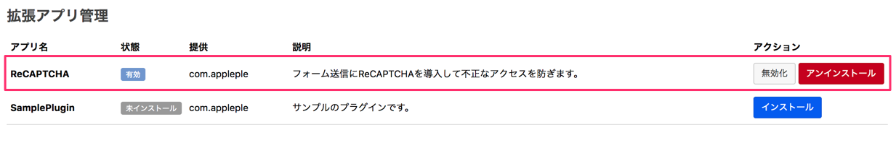
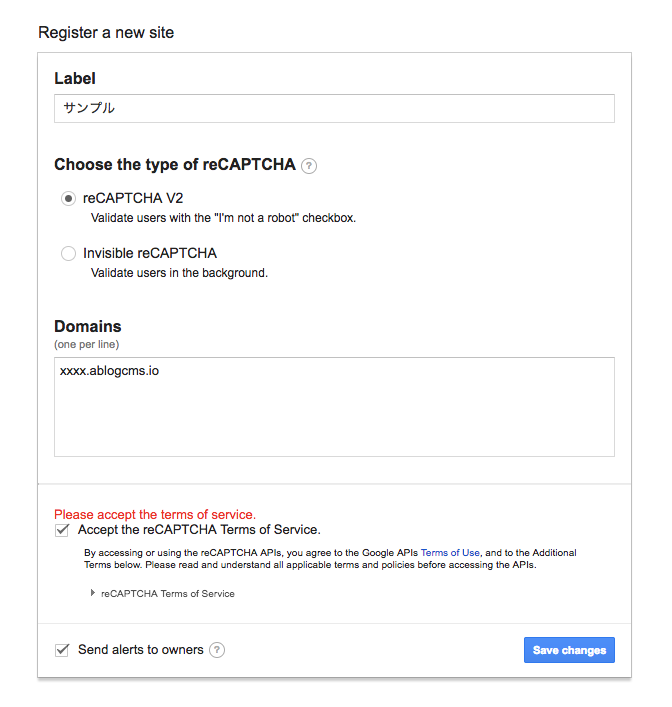
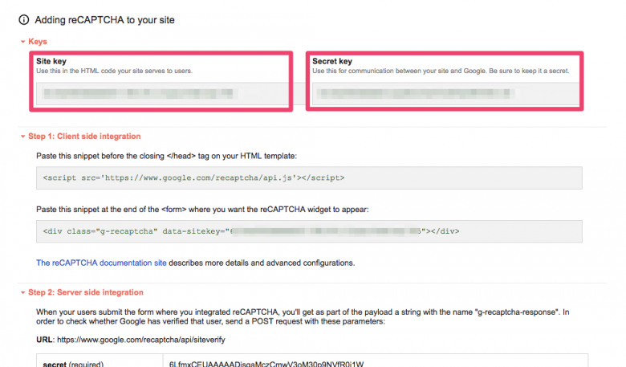
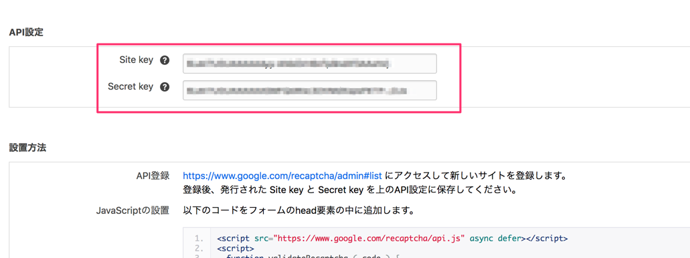
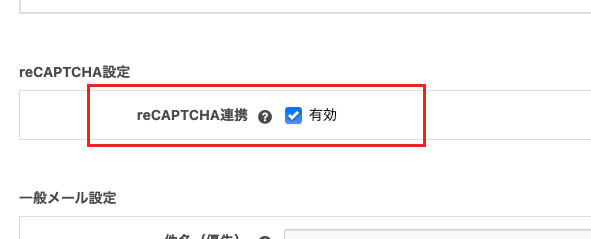
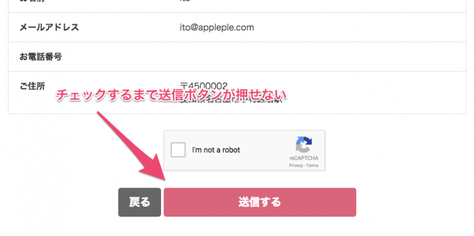

# reCAPTCHA V3 for a-blog cms

a-blog cms の 拡張アプリ「reCAPTCHA for a-blog cms」を使うと、GoogleのreCAPTCHAを使用してボットからの
フォームアクセスを防御することが出来るようになります。

## ダウンロード

[reCAPTCHA for a-blog cms](https://github.com/appleple/acms-recaptcha/releases/latest)

利用するためには最新リリースから zip をダウンロード後、解凍して **extension/plugins** に設置してください。

* extension/plugins/ReCaptcha

## 動作環境

- a-blog cms: Ver. 3.0.x – 3.2.x (3.3+ not tested yet)
- PHP: 7.3 – 8.4 (8.5+ not tested yet)


## インストール

管理ページ > 拡張アプリより「拡張アプリ管理」のページに移動します。そのページより下の図のようにreCAPTCHAをインストールします。



## API登録とキーの取得

まずreCAPTCHAを導入するために、[reCAPTCHA](https://www.google.com/recaptcha/admin#list) にアクセスして、必要な情報を取得します。

**ReCAPTCHA V3** を選択し、Domainを登録します。



**Site key** と **Secret key** をコピーしてメモしておきます。



### メモする情報

* Site key
* Secret key

## 使い方

### 設定

管理ページ > reCAPTCHA に移動し、**Site key** と **Secret key** を設定します。



管理ページ > フォーム に移動し、reCAPTCHA を利用したいフォームIDから **reCAPTCHA連携** を有効にします。



### JavaScript

以下コードを フォームテンプレートのhead要素内に読み込んでください。

```
<!-- BEGIN_MODULE Admin_InjectTemplate id="recaptcha-js" -->
<!-- END_MODULE Admin_InjectTemplate -->
```

このモジュールにより、Google reCAPTCHA API スクリプトと `recaptcha.js` が自動で注入されます。キャッシュバスティング用のクエリも自動的に付与されます。

#### 旧来の書き方（後方互換）

`Admin_InjectTemplate` を使わずに直接書くこともできます。`ACMS.Config.ReCaptcha` を設定する既存のコードも引き続き動作します。

```
<!-- BEGIN_MODULE ReCaptcha -->
<script src="https://www.google.com/recaptcha/api.js?render={sitekey}"></script>
<script src="/extension/plugins/ReCaptcha/assets/recaptcha.js"></script>
<script>
  if (window.ACMS === undefined) {
    ACMS = {};
    ACMS.Config = {};
    ACMS.Config.ReCaptcha = '{sitekey}';
  } else {
    ACMS.Ready(function () {
      ACMS.Config.ReCaptcha = '{sitekey}';
    });
  }
</script>
<!-- END_MODULE ReCaptcha -->
```

### HTML

フォーム送信時（確認画面）の form要素を修正します。<br>
form要素のclass属性に **js-recaptcha-form** クラスを追加します。

```
<form action="thanks.html" method="post" enctype="multipart/form-data" class="js-recaptcha-form">
	...
	<input type="submit" name="ACMS_POST_Form_Submit" value="送信する"/>
</form>
```

### エラー表示

eCaptchaによってロボットだと認識された場合は、Formモジュールの **step#forbidden** ブロックが表示されます。

```
<!-- BEGIN step#forbidden -->
	<p>不正なアクセスです。</p>
<!-- END step#forbidden -->
```

### 確認

クライアントサイドは完成です。フォームの確認画面まで行くと、ReCaptchaのロゴが右下に表示されていると思います。実際にフォームを送信して、送信できるか確認しましょう。



### 注意

config.server.phpでHOOKを有効にしておく必要があります。

```
define('HOOK_ENABLE', 1);
```

---

## 会員機能・ログイン認証への reCAPTCHA 適用

a-blog cms Ver. 3.0.0 以降では、コンタクトフォームだけでなく **会員ログイン・会員登録・パスワードリセット・2段階認証リカバリー** などの認証フォームにも reCAPTCHA を適用できます。

### 概要

- 対象ページを管理画面の設定で有効にするだけで機能します
- reCAPTCHA スクリプト（Google API + recaptcha.js）は対象ページの `</head>` 直前に **自動で注入** されるため、テンプレートへの JavaScript 記述は不要です
- 検証に失敗した場合は **IllegalAccess** エラーとして処理されます

### 設定方法

管理ページ > reCAPTCHA に移動し、適用したいフォームのチェックボックスを有効にして保存します。

#### Ver. 3.1.x 以降（Member / Member_Admin 名前空間）

**会員機能の設定**

| 設定項目 | 対象モジュール | コンフィグキー |
|---|---|---|
| サインイン認証 | `ACMS_POST_Member_Signin` | `google_recaptcha_member_signin` |
| 会員登録 | `ACMS_POST_Member_Signup_Submit` | `google_recaptcha_member_signup` |
| パスワードリセット | `ACMS_POST_Member_ResetPassword` | `google_recaptcha_member_reset_password` |
| 2段階認証リカバリー | `ACMS_POST_Member_Tfa_Recovery` | `google_recaptcha_member_tfa_recovery` |

> `ACMS_POST_Member_Signin` を継承する `Member_SigninWithEmail`（認証メール送信）/ `Member_SigninWithVerifyCode`（確認コード入力）も自動的に対象となります。
> `Member_Tfa_Auth`（2段階認証コード入力）は id/pass 認証済みのステップのため除外されます。

**管理ログイン機能の設定**

| 設定項目 | 対象モジュール | コンフィグキー |
|---|---|---|
| ログイン認証 | `ACMS_POST_Member_Admin_Login` | `google_recaptcha_member_admin_login` |
| パスワードリセット | `ACMS_POST_Member_Admin_ResetPassword` | `google_recaptcha_member_admin_reset_password` |
| 2段階認証リカバリー | `ACMS_POST_Member_Admin_Tfa_Recovery` | `google_recaptcha_member_admin_tfa_recovery` |

`ACMS_POST_Member_Admin_Login` を継承する `Admin_LoginWithEmail`（認証メール送信）/ `Admin_LoginWithVerifyCode`（確認コード入力）も自動的に対象となります。
`Admin_Tfa_Auth`（2段階認証コード入力）は id/pass 認証済みのステップのため除外されます。

#### Ver. 3.0.x（Login 名前空間）

**認証機能の設定**

| 設定項目 | 対象モジュール | コンフィグキー |
|---|---|---|
| ログイン認証 | `ACMS_POST_Login_Auth` | `google_recaptcha_login_auth` |
| 会員登録 | `ACMS_POST_Login_Subscribe` | `google_recaptcha_login_subscribe` |
| パスワードリセット | `ACMS_POST_Login_Remind` | `google_recaptcha_login_remind` |
| 2段階認証リカバリー | `ACMS_POST_Login_Tfa_Recovery` | `google_recaptcha_login_tfa_recovery` |

### スクリプトの自動注入について

有効な設定がある場合、プラグインが対象ページの `</head>` 直前に以下を自動で挿入します。

```html
<script src="https://www.google.com/recaptcha/api.js?render={sitekey}"></script>
<script id="acms-recaptcha-js" src="{recaptcha.jsのパス}" data-sitekey="{sitekey}"></script>
```

サイトキーは `data-sitekey` 属性で `recaptcha.js` に渡されます。`recaptcha.js` のパスにはキャッシュバスティング用のクエリが自動で付与されます。テンプレート側でのスクリプト読み込みは不要です。

### エラー表示

reCAPTCHA の検証に失敗した場合、`ACMS_GET_SystemError` モジュールの `IllegalAccess` ブロックが表示されます。

認証フォームのテンプレートに `SystemError` モジュールを配置し、`IllegalAccess` ブロックを定義してください。

```html
<!-- BEGIN_MODULE SystemError -->
<!-- BEGIN IllegalAccess -->
<div role="alert" class="acms-alert acms-alert-danger acms-alert-icon">
  <span class="acms-icon acms-icon-attention acms-alert-icon-before" aria-hidden="true"></span>
  不正なアクセスです。
  <button type="button" class="js-acms-alert-close acms-alert-icon-after" aria-label="アラートを閉じる">×</button>
</div>
<!-- END IllegalAccess -->
<!-- END_MODULE SystemError -->
```

`SystemError` モジュールは他のシステムエラー（CSRF トークン切れなど）にも使われるため、以下のようにすべてのブロックをまとめて定義したテンプレートを `include` として使い回すのが一般的です。

```html
<!-- BEGIN_MODULE SystemError -->
<!-- BEGIN IllegalPostData -->
<div role="alert" class="acms-alert acms-alert-danger acms-alert-icon">
  <span class="acms-icon acms-icon-attention acms-alert-icon-before" aria-hidden="true"></span>
  送信データが不完全です。
  <button type="button" class="js-acms-alert-close acms-alert-icon-after" aria-label="アラートを閉じる">×</button>
</div>
<!-- END IllegalPostData -->
<!-- BEGIN CsrfTokenExpired -->
<div role="alert" class="acms-alert acms-alert-danger acms-alert-icon">
  <span class="acms-icon acms-icon-attention acms-alert-icon-before" aria-hidden="true"></span>
  ページの有効期限が切れています。
  <button type="button" class="js-acms-alert-close acms-alert-icon-after" aria-label="アラートを閉じる">×</button>
</div>
<!-- END CsrfTokenExpired -->
<!-- BEGIN DoubleTransmission -->
<div role="alert" class="acms-alert acms-alert-danger acms-alert-icon">
  <span class="acms-icon acms-icon-attention acms-alert-icon-before" aria-hidden="true"></span>
  連続送信は禁止されています。
  <button type="button" class="js-acms-alert-close acms-alert-icon-after" aria-label="アラートを閉じる">×</button>
</div>
<!-- END DoubleTransmission -->
<!-- BEGIN IllegalAccess -->
<div role="alert" class="acms-alert acms-alert-danger acms-alert-icon">
  <span class="acms-icon acms-icon-attention acms-alert-icon-before" aria-hidden="true"></span>
  不正なアクセスです。
  <button type="button" class="js-acms-alert-close acms-alert-icon-after" aria-label="アラートを閉じる">×</button>
</div>
<!-- END IllegalAccess -->
<!-- END_MODULE SystemError -->
```
