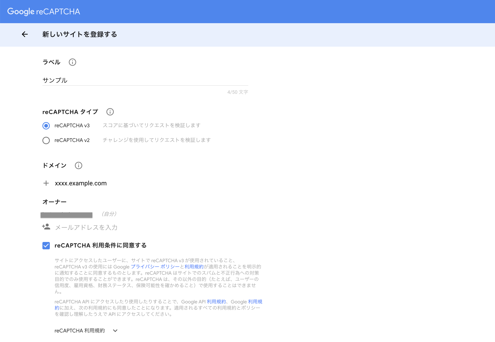
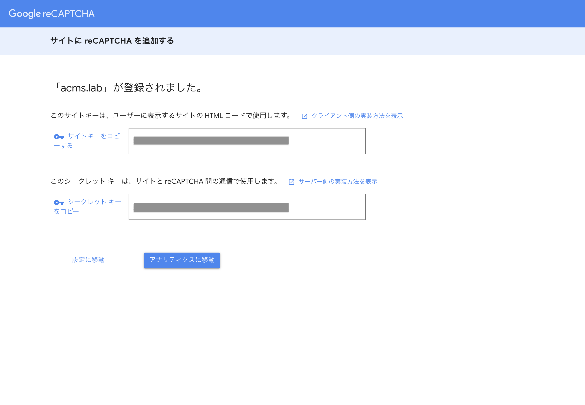
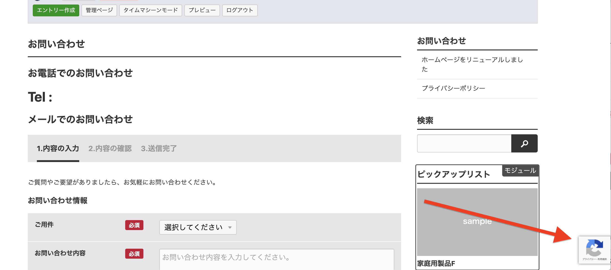

# reCAPTCHA for a-blog cms

a-blog cms の 拡張アプリ「reCAPTCHA for a-blog cms」を使うと、GoogleのreCAPTCHAを使用してボットからの
フォームアクセスを防御することが出来るようになります。この拡張アプリはVer.2.8.0より利用可能です。

## ダウンロード

[ReCaptcha for a-blog cms](https://github.com/appleple/acms-recaptcha/raw/master/build/recaptcha.zip)

利用するためにはダウンロード後、解凍して **extension/plugins** に設置してください。

* extension/plugins/ReCaptcha

## インストール

管理ページ > 拡張アプリより「拡張アプリ管理」のページに移動します。そのページより下の図のようにreCAPTCHAをインストールします。


## API登録とキーの取得

まずreCAPTCHAを導入するために、[reCAPTCHA](https://www.google.com/recaptcha/admin#list) にアクセスして、必要な情報を取得します。

**ReCAPTCHA V2** を選択し、Domainを登録します。



**Site key** と **Secret key** をコピーしてメモしておきます。



### メモする情報

* Site key
* Secret key

## 使い方

### 設定

管理ページ > reCAPTCHA に移動し、**Site key** と **Secret key** を設定します。


### JavaScript

以下コードを ご利用のテンプレートのhead要素内に読み込んでください。

```
<script src="https://www.google.com/recaptcha/api.js" async defer></script>
<script>
  function validateRecaptcha ( code ) {
    if ( !!code ) {
      var form = document.querySelector(".recaptcha");
      form.removeAttribute('disabled');
    }
  }
</script>
```

### HTML

フォーム送信時（確認画面）の form要素を修正します。ReCaptcha モジュールをformの中に置き、
送信ボタンに recaptcha クラスを追加。また disabled 属性を追加します。

```
<form action="thanks.html" method="post" enctype="multipart/form-data">
	<!-- BEGIN_MODULE ReCaptcha -->
	<div class="g-recaptcha" data-callback="validateRecaptcha" data-sitekey="{sitekey}"></div>
	<!-- END_MODULE ReCaptcha -->

	...

	<input type="submit" name="ACMS_POST_Form_Submit" value="送信する" class="recaptcha" disabled />
</form>
```

### 確認

クライアントサイドは完成です。フォームの確認画面まで行くと、reCAPTCHAが表示され、送信ボタンが押せないようになっているかと思います。reCAPTCHAで承認が通ると送信ボタンが押せるようになります。



### 注意

config.server.phpでHOOKを有効にしておく必要があります。

```
define('HOOK_ENABLE', 1);
```


